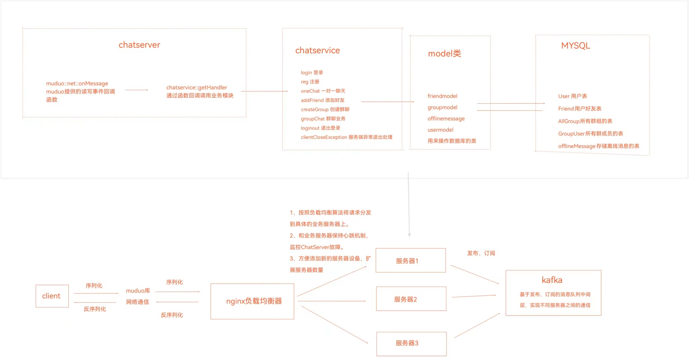

# 基于muduo的集群服务器设计

本集群服务器项目基于muduo网络库进行设计，通过redis缓存服务、mysql数据库连接池、cookie登录、多线程等技术，实现了基于TCP协议的高并发集群聊天服务器，同时使用中间件kafka进行服务器之间的通信，方便服务器扩展。

## install
安装mysql，修改mysql用户名为root，密码为123456，也可以在源码中替换为你自己的账号和用户名。  进入msql中，执行mysql脚本文件： source ./chat_server.sql
本项目中所用到的mysql表：  

**User**  
|字段名称|字段类型|字段说明|约束|  
|-------|--------|-------|------|
|id|int|用户id|PRIMARY KEY、AUTO_INCREMENT|  
|password|varchar(50)|用户密码|NOT NULL|  
|state|enum('online','offline')|用户在线状态|DEFAULT 'offline')|    
  
**Friend**  
|字段名称|字段类型|字段说明|约束|  
|-------|--------|-------|------|
|userid|int|用户id|NOT NULL、联合主键|  
|friendid|int|好友id|NOT NULL、联合主键|  
   
**AllGroup**  
|字段名称|字段类型|字段说明|约束|  
|-------|--------|-------|------|
|id|int|群id|PRIMARY KEY、AUTO_INCREMENT|  
|groupname|varchar(50)|群聊名称|NOT NULL| 
|groupdesc|varchar(200)|群聊简介|default ''| 
  
**GroupUser**  
|字段名称|字段类型|字段说明|约束|  
|-------|--------|-------|------|
|groupid|int|群好友id|NOT NULL、联合主键|
|userid|int|用户id|NOT NULL、联合主键|    
|grouprole|enum('creator','normal')|群成员角色|default 'normal'|
  
**offlineMessage**
 |字段名称|字段类型|字段说明|约束|  
 |-------|--------|-------|------|
|userid|int|用户id|NOT NULL|    
|message|varchar(500)|离线消息内容|NOT NULL|

安装redis

安装hiredis

安装并启动kafka

安装nginx
configure 加上--with-stream参数

sh install.sh

## 启动
cd ${PROJECT_DIR}/bin  
启动服务器： ./ChatServer   127.0.0.1 6000  
启动客户端： ./ChatClient   127.0.0.1 6000

